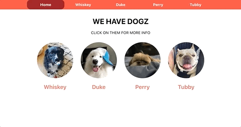
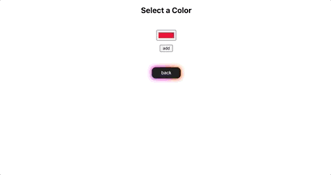

# React Router Patterns

## Part 1: React Router Dog Finder

Build an app that routes to different dogs and displays information on that dog when you’re at that route.

The routes should look like this:

- **_/dogs_** is the homepage and shows all three dogs
- Clicking on a dog from the homepage takes you to that dog’s route. For example, clicking on Whiskey will take you to **_/dogs/whiskey_**.
- every other endpoint not listed should redirect you to **_/dogs_**.

Recommended Structure

You can preload the **_<App />_** component with the following **_defaultProps_** for convenience:

```js
App.defaultProps = {
  dogs: [
    {
      name: 'Whiskey',
      age: 5,
      src: whiskey,
      facts: [
        'Whiskey loves eating popcorn.',
        'Whiskey is a terrible guard dog.',
        'Whiskey wants to cuddle with you!'
      ]
    },
    {
      name: 'Duke',
      age: 3,
      src: duke,
      facts: [
        'Duke believes that ball is life.',
        'Duke likes snow.',
        'Duke enjoys pawing other dogs.'
      ]
    },
    {
      name: 'Perry',
      age: 4,
      src: perry,
      facts: [
        'Perry loves all humans.',
        'Perry demolishes all snacks.',
        'Perry hates the rain.'
      ]
    },
    {
      name: 'Tubby',
      age: 4,
      src: tubby,
      facts: [
        'Tubby is really stupid.',
        'Tubby does not like walks.',
        'Angelina used to hate Tubby, but claims not to anymore.'
      ]
    }
  ]
}
```

The **_<App />_** should render:

- a **_<Nav />_** component with the dogs’ names passed as props
- a **_<Switch>_** with your **_<Route />_** declarations
  Here is an Example Snippet from the `render` method of **_<App />_** To Get You Started:

```js
return (
  <Switch>
    <Route exact path="/dogs">
      <DogList /> // what props will this need?
    </Route>
    <Route path="/dogs/:name">
      <DogDetails /> // what props will this need?
    </Route>
    <Redirect to="/dogs" />
  </Switch>
)
```

In this example:

- **_<DogList />_** takes all the dog info from the props of **_<App />_**
- **_<DogDetails />`_** shows all of the info about a single dog
- In **_<DogDetails />_**, how will you derive the current dog, e.g. `whiskey`?
- Bonus: is there a way to get the current dog before you render the component, passing dog instead of the entire list of dog data?

Here’s an idea of what your app could look like:

[](_images/dog-finder-demo.gif)

## Part 2: React Router Color Factory

The goal of this exercise will be to use React Router to build an app that lets you view colors and add new colors.

### User Stories

1. As a user, I can go to **_/colors_** to see a list of all available colors.

2. As a user, I can click on one of the colors in my colors list and get taken to a page where I can see that color in all its glory.

   (The route here should be **_/colors/:color_** )

3. As a user, I can click on a button to show a form that will let me add a new color.

Note that you can give an input a type of color if you’re trying to select a color. (The route here should be **_/colors/new_**)

4. As a user, when I submit my new color form, I am redirected to the colors index, and my new color appears at the top.

5. As a user, if I try to navigate to a color page that does not exist (eg, **_/colors/blargh_**), I am redirected to the colors index page.

6. As a user, if I try to navigate to an invalid url (eg, **_/this-is-not-valid_**), I am redirected to the colors index page.

Here’s an idea of what your app could look like:

[](_images/color-factory.gif)

## **How to Run**

    $ git clone https://github.com/cng008/41.2_react-router-patterns.git
    $ cd dog-finder  OR  $ cd color-factory
    $ npm install
    $ npm start
